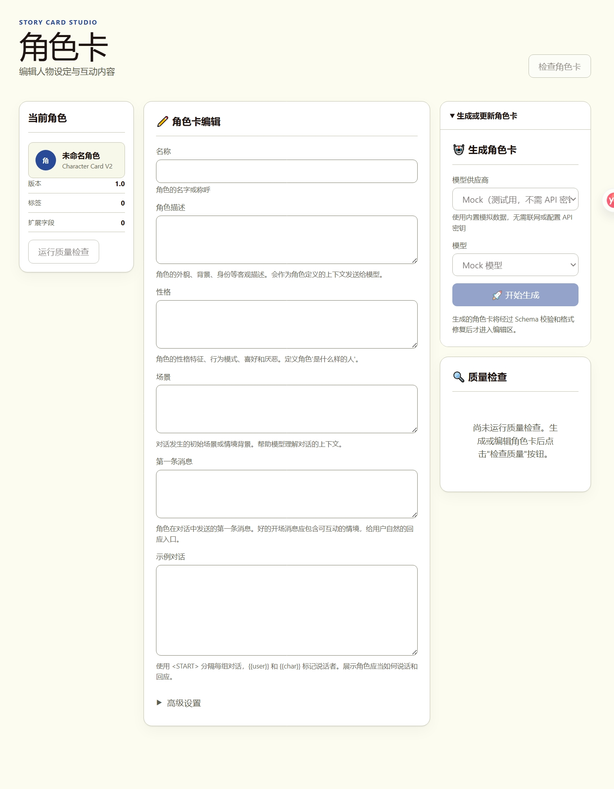

**使用其它语言: [中文](README.md), [English](README_en.md).**
# Story Card Studio

> 面向中文长篇创作者的本地优先创作工作台：在同一个项目里管理角色、世界设定、剧情规划、章节场景、正文版本与全书连续性。

 [下载最新版本](https://github.com/Koukou0506/Story-Card-Studio/releases) · [SillyTavern 扩展](#sillytavern-扩展) · [使用文档](#使用文档)


Story Card Studio 不是只生成一张角色卡的表单，也不是无人监督的“一键写书”工具。它更像一张可以逐步扩展的创作工作台：从模糊想法开始，建立角色卡和世界书，检查剧情是否成立，规划故事与章节，在版本保护下生成或修订正文，再用 Canon、时间线、剧情线和伏笔维护长篇连续性。

没有 API 密钥也能使用内置 Mock Provider 体验主要流程。接入真实模型时，密钥保存在服务端环境变量中，不会写入浏览器项目、导出文件或 SillyTavern 扩展。


## 目录

- [适合谁](#适合谁)
- [核心能力](#核心能力)
- [快速开始](#快速开始)
- [推荐工作流](#推荐工作流)
- [功能详解](#功能详解)
- [作品导入与重建](#作品导入与重建)
- [移动端与跨设备](#移动端与跨设备)
- [SillyTavern 扩展](#sillytavern-扩展)
- [数据与隐私](#数据与隐私)
- [常见问题](#常见问题)
- [开发者信息](#开发者信息)

## 适合谁

- 想从零整理原创角色、世界规则和故事方向的创作者；
- 需要比较剧情方案，检查人物动机、因果链和关系推进的作者；
- 需要把宏观故事拆成卷、章、场景，并追踪状态变化的长篇作者；
- 希望在版本保护下生成、续写、局部重写和恢复正文的人；
- 需要维护 Canon、人物状态、知情状态、伏笔和时间线的项目；
- 想把 TXT、PDF、EPUB、DOCX 或 Markdown 旧稿重建为结构化项目的人；
- 希望从 SillyTavern 发送角色卡、World Info 或选定聊天进行分析的用户。

当前不以无人监督整本生成、特定在世作者模仿、AI 作者身份鉴定、自动联网核对同人资料、公共社区或多人协作为目标。

## 核心能力

| 环节 | 可以完成的工作 | 数据保护 |
| --- | --- | --- |
| 角色与世界 | 生成、编辑、检查、导入和导出角色卡与世界书 | 保留未知扩展字段，冲突不静默覆盖 |
| 剧情分析 | 分析因果、动机、信息能力、关系和世界规则 | 判断附来源，区分确定错误与启发式风险 |
| 故事规划 | 故事圣经、角色弧、关系路线、情节节点和时间线 | 锁定内容不会被局部生成覆盖 |
| 章节与场景 | 分卷、分章、场景卡、视角、信息流和状态继承 | 检查节点覆盖和入口/出口连续性 |
| 正文写作 | 场景生成、续写、局部改写、Diff 和版本恢复 | 新结果先成为备选版本 |
| 连续性 | Canon、Retcon、实体、状态、知情、剧情线和伏笔 | 候选需确认，历史记录保留 |
| 项目维护 | 可视化、项目助手、设定传播、素材与模板 | 写入先创建提案，正文只通过 Revision 修改 |
| 作品重建 | 多格式解析、OCR、分章、去重和候选提取 | 先预览重建方案，不覆盖已有内容 |

## 快速开始

### 普通用户：使用 Releases 运行包

1. 打开 [GitHub Releases](https://github.com/Koukou0506/Story-Card-Studio/releases)。
2. 下载最新的 `story-card-studio-server-v*.zip`。若某个版本暂未提供运行包，请使用下方源码方式。
3. 安装 [Node.js 22 或更高版本](https://nodejs.org/)。
4. 解压后，Windows 双击 `start.cmd`，macOS/Linux 运行 `start.sh`。
5. 浏览器打开 `http://localhost:3000`。


### 开发者：从源码运行

```bash
git clone https://github.com/Koukou0506/Story-Card-Studio.git
cd Story-Card-Studio
npm install
cp .env.example .env.local
npm run dev
```

Windows PowerShell 使用 `Copy-Item .env.example .env.local`。启动后访问 `http://localhost:3000`。

### 不配置 API 也能体验

默认 Mock Provider 不需要密钥，会返回固定示例数据，适合熟悉界面和验证工作流。使用真实服务时，在 `.env.local` 配置：

```dotenv
DEFAULT_PROVIDER=openai
OPENAI_API_KEY=your-key
```

或：

```dotenv
DEFAULT_PROVIDER=anthropic
ANTHROPIC_API_KEY=your-key
```

真实模型可能产生费用，价格和模型名称会变化，请以 Provider 官方说明为准。

## 推荐工作流

### 从创意到正文

```text
创意输入 → 角色卡与世界书 → 剧情分析 → 故事规划
        → 章节与场景 → 正文草稿与修订 → 连续性检查
```

第一次使用建议先用 Mock Provider：创建创意，生成角色卡和几条世界设定，分析一段剧情，建立一个场景计划，再生成备选正文。最后导出项目 JSON，熟悉备份方式。

### 从已有作品重建

```text
选择文件 → 文本提取/OCR → 确认卷章 → 检查重复与版本
        → 提取候选资料 → 预览重建方案 → 写入草稿或新版本
```

### 从 SillyTavern 使用

```text
选择角色、World Info 或聊天范围 → 预览发送内容
→ 连接工作区 → 分析/生成 → 查看差异 → 确认写回或导出
```

## 功能详解

### 项目首页与创意输入

项目首页汇总进度、最近资料、健康提示和继续创作入口。创意输入保存原始构思、原创或同人模式、创作目标和约束，作为后续生成的基础上下文。模型输出不会覆盖原始输入。

### 角色卡

兼容 Character Card V2 的主要字段，可从创意生成草稿，也可导入已有 JSON。

- 编辑描述、性格、场景、开场白、示例对话和创作者说明；
- 提供基础与高级字段编辑，以及质量检查；
- 导入、导出并重新导入 Character Card V2 JSON；
- 尽量保留未知 `extensions`；
- 读取、合并、替换或写回 Character Book；
- 冲突先预览，不无提示覆盖原卡。



### 世界书

内部 Lorebook 模型同时适配 Character Card V2 Character Book 和 SillyTavern 独立 World Info。

- 从创意、角色卡或两者联合生成；
- 新建、复制、删除、排序、搜索和批量启停条目；
- 编辑主/次关键词、常驻状态、插入顺序和位置；
- 支持大小写、正则、概率、扫描深度、sticky、cooldown、delay 等高级数据；
- 用本地近似模拟器解释关键词触发结果；
- 检查空条目、过宽或重复关键词、无效正则和内容重复；
- 显示格式不能无损表达的字段，保留未知及格式专属数据。

> 📷 **截图待补：世界书与激活模拟器**  
> 内容建议：条目列表、关键词、高级设置和模拟结果。  


### 剧情分析

支持单方案分析和最多三个分支比较，重点解释剧情为什么成立或不成立。

- 检查因果链、人物动机、信息来源、能力资源和世界规则；
- 分析情绪变化、关系阶段、信任和行为强度；
- 每个问题显示严重程度、置信度、依据、来源和最小修改建议；
- 区分硬矛盾、启发式风险、信息不足和审美偏好；
- 保存报告并导出 Markdown/JSON；
- 来源资料更新后，旧报告会提示可能过期。

上下文构建器只筛选相关角色和世界书条目，不默认发送整个项目。

> 📷 **截图待补：剧情分析报告**  
> 内容建议：综合结论、维度评分、严重问题和来源引用。  


### 故事规划

- 故事圣经：主题、视角、冲突、目标、风险、代价和结局方向；
- 角色规划与角色弧：需求、恐惧、错误信念、关键选择和事件关联；
- 关系路线：初始关系、权力、信任、转折和最终状态；
- 自由、三幕、四幕或自定义宏观结构；
- 因果依赖、简单时间线和角色/关系/世界状态变化；
- 多个规划版本的创建、采用、废弃和比较。

字段和节点可以锁定；局部重新生成不会修改未选择模块。

### 章节与场景

- 从情节节点创建分卷和章节；
- 为章节记录视角、时间、地点、目标、触发、转折、结果和钩子；
- 为场景记录入场状态、角色目标、冲突、行动、转折和离场状态；
- 管理作者、读者和角色分别知道什么；
- 记录铺垫、强化、计划回收和实际回收；
- 检查情节节点未覆盖、重复覆盖或偏离；
- 检查相邻场景的时间、地点、人物、身体、情绪、关系、信息和物品连续性；
- 保存并比较章节或场景版本。

移动端不以拖拽作为唯一操作方式。

> 📷 **截图待补：章节与场景规划**  
> 内容建议：章节列表、场景卡、状态继承和问题提示。  


### 正文写作

正文工作区围绕原稿保护设计：任何生成或修订先创建备选 Draft Version 或 Revision。

- 生成完整场景、开头、冲突、转折或结尾；
- 从光标续写，或重写、扩写、压缩选区；
- 增强对话、动作、心理、环境和节奏；
- 用 Edit Scope 限制文档、场景、段落、选区、对话或叙述范围；
- 锁定段落，保护选区外文字；
- 查看段落级 Diff，全部或部分接受、拒绝并恢复历史版本；
- 检查场景计划覆盖、视角、时态和信息越权；
- 提取新增事实和状态变化候选，确认前不写回设定；
- 导出 Markdown、纯文本或完整版本 JSON。

> 📷 **截图待补：正文编辑与修订对比**  
> 内容建议：编辑器、生成控制、Diff 和版本历史。  


### 文本诊断与风格规则

Style Profile 保存句长、段落、对话/动作/心理/环境比例、情绪克制度、叙述距离和总体语气。Language Constraint 保存项目、角色或场景级语言规则。

“AI 味与文本机械感诊断”检查重复句式、段尾总结、抽象情绪、过度解释、对话同质和项目文风偏离。短文本只提供局部提示；模型不可用时仍可运行本地指标。

> **限制：**它分析风格风险，不能证明文本由 AI 或人类创作，也不能作为作弊或作者身份鉴定证据。

### 连续性中心

- Canon Ledger：候选、确认、锁定、冲突和废弃；
- Retcon：保留新旧事实、生效范围和未处理影响；
- 实体索引与人物、关系、世界状态快照；
- 读者和各角色的知情、误解、怀疑与秘密状态；
- 剧情线、未解决问题和伏笔设置/强化/回收；
- 整合规划、正文和状态的全书时间线；
- 规划与正文偏差、连续性问题和项目健康报告；
- 下一章目标、继承状态、知情、物品和风险上下文包。

候选事实不会自动成为 Canon，同名实体不会仅因名称相同而合并。

> 📷 **截图待补：连续性中心**  
> 内容建议：Canon、剧情线、伏笔、问题和健康概览。  


### 可视化、项目助手与设定变更

可视化工作台提供关系图、实际/叙事双时间线、剧情线、伏笔、知情矩阵、章节节奏和角色出场视图，并提供可访问的列表替代及 PNG/SVG、CSV、JSON 导出。它只用于查看和导航。

项目助手通过受限工具查询项目，重要回答附带来源。写入请求只创建 Change Proposal，确认后才进入版本和 Diff 流程。

设定变更可以分析姓名、年龄、身份、关系、地点、术语、物品归属和事件时间的直接、派生与下游影响。用户选择传播范围；正文只创建 Revision，不直接批量覆盖。

### 素材与模板

支持把角色卡、世界书、规划模板、Style Profile、Language Constraint 和角色语言档案保存为版本化素材。

- **复制**：进入项目后独立；
- **引用**：保留素材关联；
- **派生**：保存基础版本和项目差异；
- **项目模板**：预览后创建项目。

上游更新只生成提案，不会自动同步。项目模板默认不包含正文、聊天、密钥或令牌。

## 作品导入与重建

用于把你有权处理的旧稿转换为可继续维护的项目。

| 格式 | 支持范围 | 限制 |
| --- | --- | --- |
| TXT | UTF-8、BOM、UTF-16、GB18030 等 | 编码不确定时需预览确认 |
| PDF | 具有文本层的 PDF，保留页码 | 多栏和异常字符映射会警告 |
| 扫描 PDF | 可选本地 Tesseract + Poppler OCR | 需要额外安装，质量取决于扫描件 |
| EPUB | 按 Spine 顺序提取 XHTML | 受保护/损坏文件不可解析，图片只保留引用 |
| DOCX | 段落、Heading、列表、表格、脚注、注释和修订 | 复杂版式可能只能警告 |
| Markdown | 标题、Front Matter、引用、链接、HTML 和代码块选项 | 分析文本移除语法但保留来源位置 |

可混合批量导入，单文件失败不会终止任务。处理支持中止、失败块重试和检查点恢复。

流程为：选择文件 → 解析设置 → 内容预览 → 卷章结构 → 重复与版本 → OCR 校对 → 提取设置 → 候选资料 → 重建方案 → 写入结果。

重要结果带 Source Span，可跳回文件、章节、页码、段落或字符范围。正式写入时，正文创建新版本，角色卡和世界书进入草稿，其余资料进入候选；现有内容不会被静默覆盖。

> 📷 **截图待补：作品导入与重建**  
> 内容建议：文件清单、卷章确认、候选资料和重建方案。  


## 移动端与跨设备

Story Card Studio 是响应式 Web 应用，不需要原生手机 App。

- 同一局域网可访问 `http://<电脑局域网 IP>:3000`；
- 支持移动抽屉、底部快捷导航、单列工作区和安全区；
- 正文可全屏编辑；表格提供卡片或横向滚动替代；
- 可安装为 PWA；离线时可打开应用壳、编辑本机项目和导出 JSON；
- 离线模型操作会明确禁用，不无限重放失败请求；
- 工作区模式允许电脑和手机使用同一服务端项目；
- 保存携带版本号，旧客户端不会静默覆盖新版本。

远程访问必须使用 HTTPS、认证和受控网络，不要把无认证服务直接暴露到公网。

## SillyTavern 扩展

在 SillyTavern 扩展安装界面填写仓库地址并选择 `sillytavern-extension` 分支，也可从 Releases 下载 ZIP：

```text
https://github.com/Koukou0506/Story-Card-Studio
```

扩展可以读取当前角色卡、Character Book、World Info 和用户选择的聊天范围，连接工作区运行角色、世界、剧情、连续性与文本诊断，并显示差异。

所有发送由用户触发，聊天发送前有预览；扩展不保存 Provider API Key，不自动上传聊天。缺少稳定公开写回接口时会降级为导出 JSON，而不是修改 SillyTavern 内部对象。

> 📷 **截图待补：SillyTavern 扩展**  
> 内容建议：当前上下文、发送预览、工具和任务状态。  
> 建议路径：`docs/images/readme/sillytavern-extension.webp`。

## 数据与隐私

### 数据保存

- 本机项目优先保存在浏览器 IndexedDB；
- 旧 localStorage 草稿会迁移并保留恢复镜像；
- 工作区项目保存在服务端配置的持久化目录；
- 导入作品的原始文件和提取文本使用独立本地资产存储；
- 项目 JSON 可能包含正文和提取分块，应作为私密资料保存。

建议定期备份项目 JSON、工作区数据目录、`.env.local` 配置和仍需保留的导入资产。删除旧源码或运行目录前必须先确认备份可用。

### 外部模型边界

- Mock Provider 不发送外部请求；
- 文件解析可选择纯本地；
- 外部分析只发送所选文本和必要上下文；
- 长作品分块处理，不默认发送整本；
- Provider 密钥不进入浏览器项目、导出、PWA Cache 或扩展；
- 请只处理你拥有权利或获得许可的文本。

## 导入导出与兼容性

支持完整项目 JSON、Character Card V2 JSON、SillyTavern World Info、Character Book、报告 Markdown/JSON、正文 Markdown/纯文本/JSON、可视化文件和素材包。

角色卡和世界书适配器尽量保留未知 `extensions` 和格式专属字段。目标格式无法表达某字段时会显示兼容性警告。详见 [兼容性文档](https://github.com/Koukou0506/Story-Card-Studio/blob/main/docs/compatibility.md)。

## 常见问题

### 会自动覆盖我的正文或设定吗？

不会。模型结果先成为草稿、候选、备选版本或 Change Proposal；正文修改使用 Revision 和 Diff，用户确认后才接受。

### 能自动写完整本小说吗？

当前生成以选定规划模块、章节、场景或文本范围为单位，不提供无人监督连续写整本。

### 可以完全不用真实模型吗？

可以用 Mock Provider体验流程；格式转换、搜索、激活模拟和一部分本地检查也不依赖模型。

### 可以删除下载后的源码文件夹吗？

使用独立服务端运行包时，可以不保留仅用于构建的源码副本；但不要删除正在运行的目录、工作区数据、`.env.local` 或未备份的导入资产。先导出项目 JSON 并验证备份。

### 为什么报告显示“可能过期”？

报告记录所依据的角色卡、世界书、规划或正文版本。来源更新后旧结果仍保留，但会提示重新检查。

### 扫描 PDF 为什么不能直接读取？

扫描 PDF 没有文本层，需要本地 OCR。未安装 OCR 依赖时会明确显示不可用状态，不会伪造解析结果。

### 文本诊断是 AI 检测器吗？

不是。它只分析机械感、重复、过度解释和文风偏离风险。

## 使用文档

| 文档 | 内容 |
| --- | --- |
| [服务端运行包](https://github.com/Koukou0506/Story-Card-Studio/blob/main/docs/server-package.md) | 启动、升级、目录和迁移 |
| [移动端与 PWA](https://github.com/Koukou0506/Story-Card-Studio/blob/main/docs/mobile-and-pwa.md) | 手机、离线、工作区和冲突 |
| [作品解析](https://github.com/Koukou0506/Story-Card-Studio/blob/main/docs/document-ingestion.md) | TXT/PDF、分块和来源追踪 |
| [作品重建](https://github.com/Koukou0506/Story-Card-Studio/blob/main/docs/work-import-and-rebuild.md) | 多格式、OCR、版本和重建 |
| [格式兼容](https://github.com/Koukou0506/Story-Card-Studio/blob/main/docs/compatibility.md) | Character Book 与 World Info |
| [剧情分析](https://github.com/Koukou0506/Story-Card-Studio/blob/main/docs/analysis-methodology.md) | 维度、严重程度与评分 |
| [故事规划](https://github.com/Koukou0506/Story-Card-Studio/blob/main/docs/planning-methodology.md) | 故事圣经、角色弧和因果 |
| [章节与场景](https://github.com/Koukou0506/Story-Card-Studio/blob/main/docs/chapter-planning-methodology.md) | 视角、信息流和状态继承 |
| [正文写作](https://github.com/Koukou0506/Story-Card-Studio/blob/main/docs/prose-generation-methodology.md) | Edit Scope、Revision 与保护 |
| [连续性](https://github.com/Koukou0506/Story-Card-Studio/blob/main/docs/continuity-methodology.md) | Canon、状态、剧情线和伏笔 |
| [文本诊断](https://github.com/Koukou0506/Story-Card-Studio/blob/main/docs/style-risk-analysis.md) | 基准、隐私和复检 |
| [系统架构](https://github.com/Koukou0506/Story-Card-Studio/blob/main/docs/architecture.md) | 领域层、服务、存储和 UI |

## 开发者信息

```bash
npm run dev                         # 开发
npm run typecheck                   # 类型检查
npm test                            # 自动化测试
npm run build                       # 生产构建
npm start                           # 启动生产服务
npm run package:server              # 打包服务端运行包
npm run build:sillytavern-extension # 构建扩展
```

主要技术：Next.js 16、React 19、TypeScript 5、Zod 4、Vitest、Tailwind CSS 4。

| 环境变量 | 说明 | 默认值 |
| --- | --- | --- |
| `OPENAI_API_KEY` | OpenAI 密钥 | 空 |
| `ANTHROPIC_API_KEY` | Anthropic 密钥 | 空 |
| `DEFAULT_PROVIDER` | `openai`、`anthropic` 或 `mock` | `mock` |
| `API_TIMEOUT_MS` | Provider 超时，毫秒 | `60000` |
| `WORKSPACE_ACCESS_TOKEN` | 单用户工作区长随机令牌，至少 24 位 | 空，工作区关闭 |
| `WORKSPACE_DATA_DIR` | 服务端项目持久化目录 | `.workspace-data` |
| `WORKSPACE_ALLOWED_ORIGINS` | 允许的额外 Origin | 空 |
| `WORKSPACE_BODY_LIMIT` | 工作区请求体字节上限 | `31457280` |

提交 Issue 时请提供系统、Node.js 和浏览器版本及最小复现步骤，并删除日志、截图和示例数据中的密钥、令牌和私人正文。

## License

[MIT License](LICENSE)
